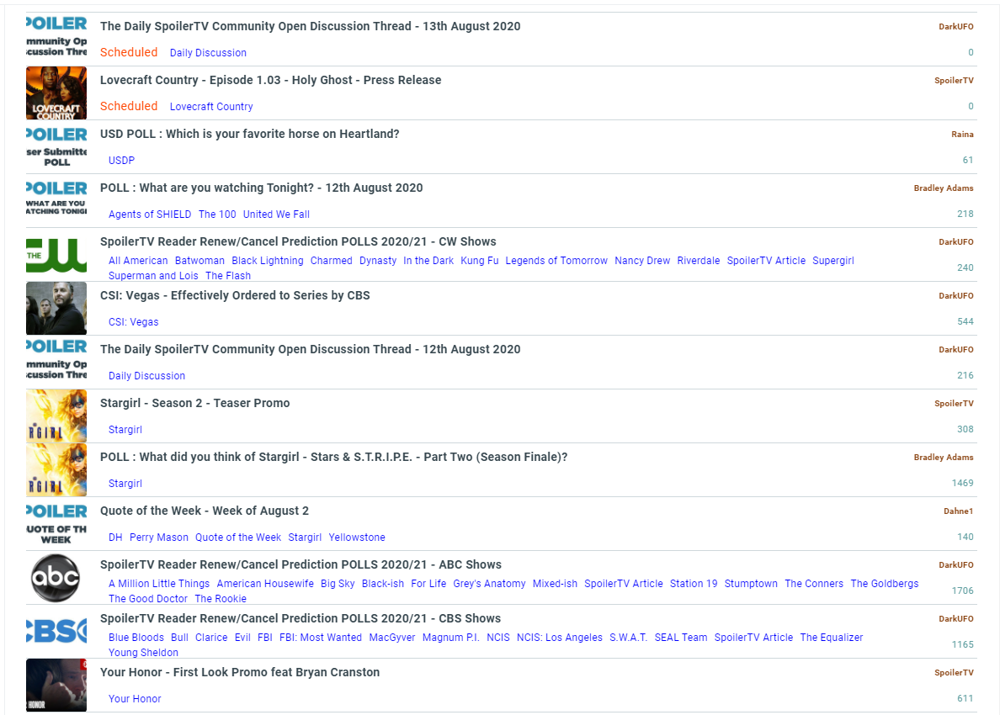

# newbloggerui
CSS Overrides for the New Blogger User Interface. Can be used with extensions like Stylebot

This will provide a much cleaner and compact version of the Blogger Dashboard for users who actually use a computer and a large monitor.

Currently displays 6 more articles per page on a standard 1920 X 1440 Monitor

**Version History**

Version 0.5
- Increased height of Label Filter Modal Window on Dashboard (Screenshot below)
- Increased width of Labels section on the Editor (Screenshot below)
- Decreased Padding and Font Size of Labels on both of the above (Screenshot below)

Version 0.4
- Hoover over Tools reduced in size and now black
- Label Filter Modal Font padding reduced
- All Article labels are now clickable

Version 0.3
- Dot Separator between Post Status and Date removed
- Fixed issue with schedule time being hidden

Version 0.2 
- Reduced Padding between row
- Current Row highlighted
- Removed Published Text

Version 0.1 - Initial Version

**BEFORE**

**AFTER**

**Filter Screens**

